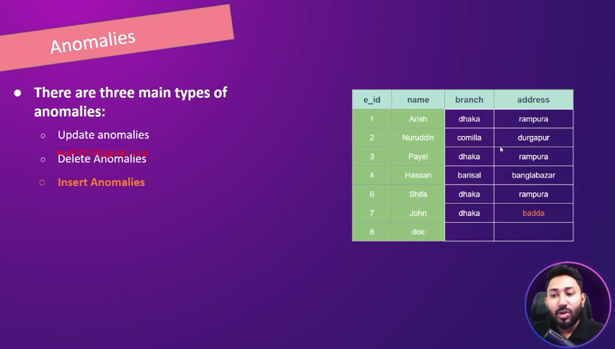
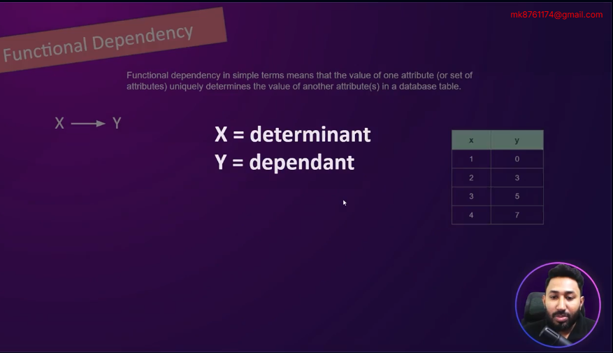
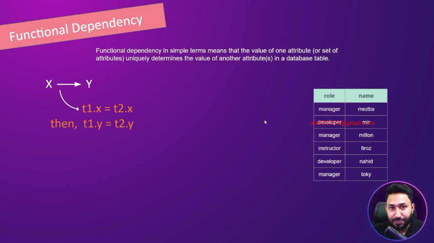
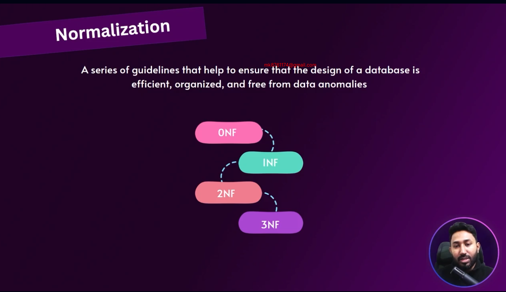
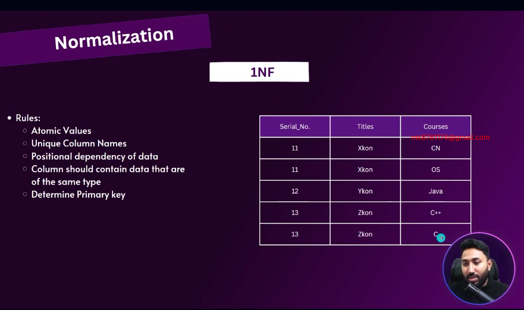
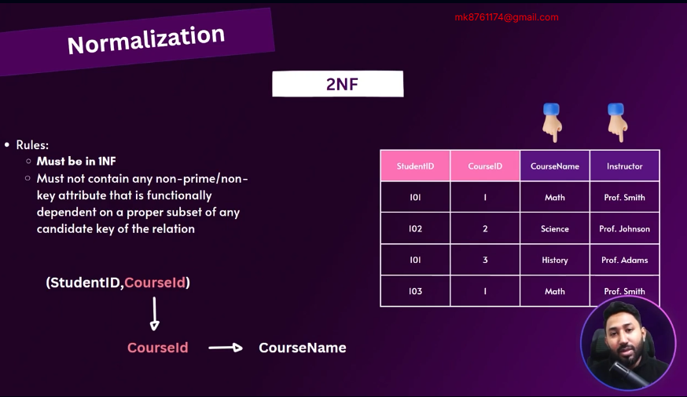
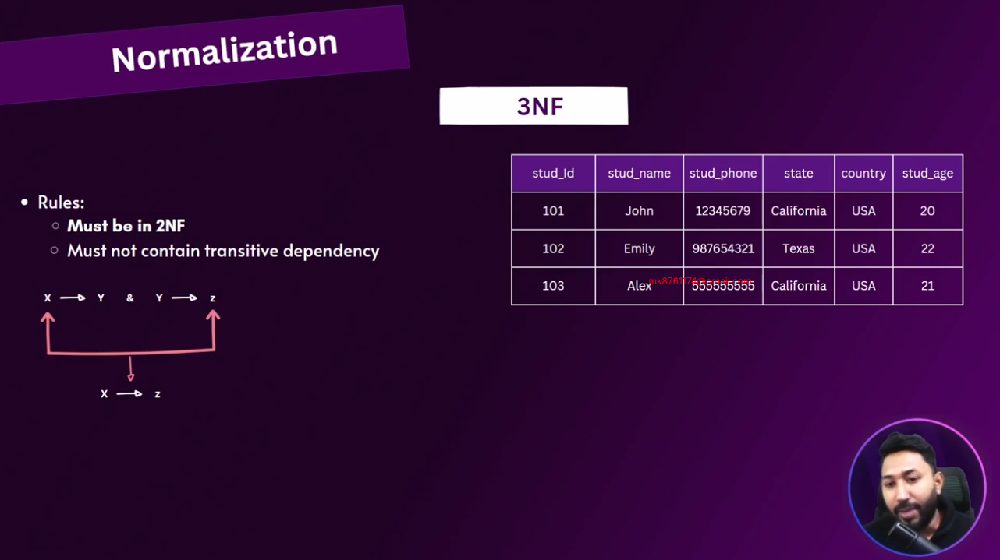
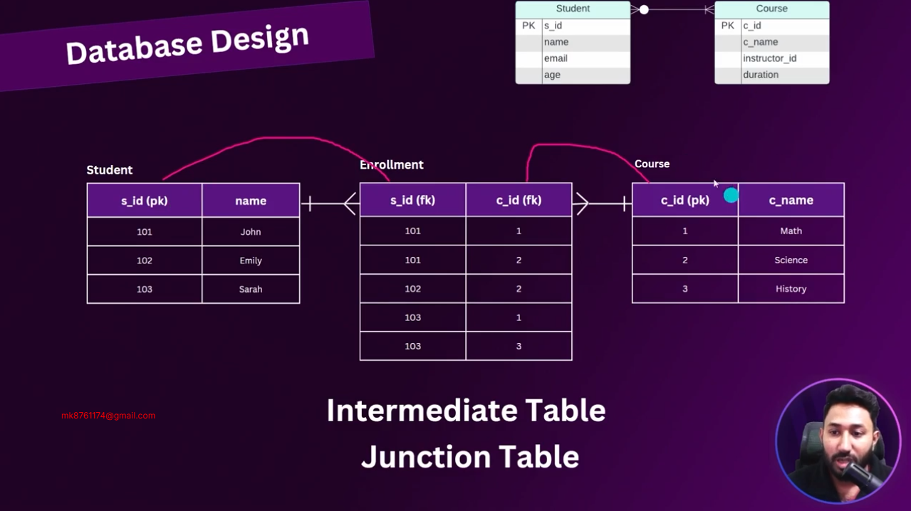
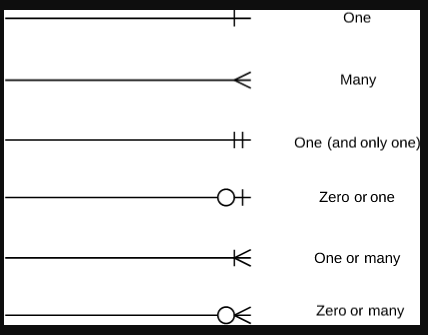
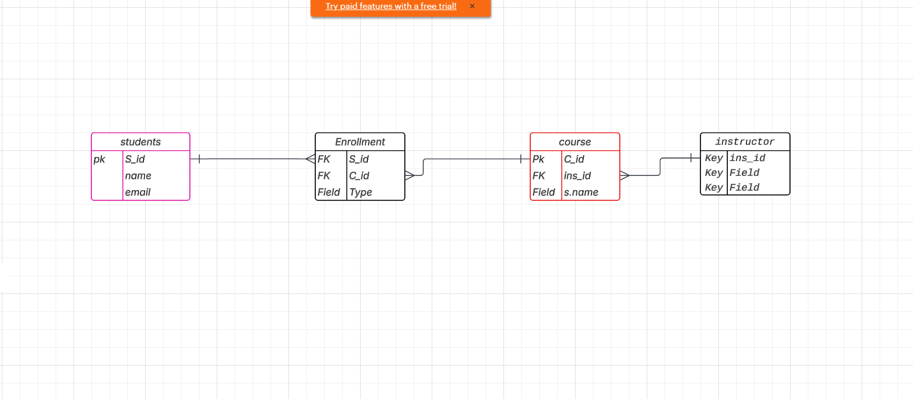

# Database-Normalization-Postgres-Installation-and-Application-Insight
Case Study File Link: https://lily-plate-b6a.notion.site/Case-Study-082bcd700e034e0b85a54bf82ba590ab?pvs=4
# Case Study

A Medical Database System is needed to enhance the efficiency and effectiveness of healthcare services. This system will be able to seamlessly integrates the information of patients, doctors, appointments, medical records, and medical facilities.

**Entities:**

1. **Patients:**
    - Attributes: PatientID (Primary Key), FirstName, LastName, DateOfBirth, Gender, ContactNumber, Email
2. **Doctors:**
    - Attributes: DoctorID (Primary Key), FirstName, LastName, Specialization, ContactNumber, Email
3. **Appointments:**
    - Attributes: AppointmentID (Primary Key), PatientID (Foreign Key), DoctorID (Foreign Key), AppointmentDate, AppointmentTime, Status
4. **Medical Records:**
    - Attributes: RecordID (Primary Key), AppointmentID (Foreign Key), Diagnosis, Prescription, TestResults, createdAt
5. **Medical Facilities:**
    - Attributes: FacilityID (Primary Key), FacilityName, Location, ContactNumber

**Relationships:**

- Patients can have multiple appointments with different doctors.
- Doctors can have multiple appointments with different patients.
- Each appointment may have a corresponding medical record, and vice versa.
- A medical facility can have multiple doctors, and a doctor can work in multiple medical facilities. This relationship is represented through a junction table.

## 6-1 understanding Anomalies
- Anomalies in database refer to unexpected issues that can occur during data manipulation or retrieval 
## there are 3 main types anomalies

## 6-2 Understanding Functional Dependency.
## What is Normalization?
- Normalization is organize data in database

# Normalization in 2 types 1.Functional Dependency 2.Normal Forms

1. # Functional Dependency

If two rows have the same value of attribute X, and in both cases the value of Y is also the same, then we say:
X → Y (X functionally determines Y)
if not same? not functional Dependency

🔹 What is Functional Dependency?
In a database table, if one column's value uniquely decides another column’s value, we call that a functional dependency.

We write it as:

X → Y
(Read as: "X determines Y")

That means:

If two rows have the same value of X, they must have the same value of Y.

✅ Example:
StudentID 	Name	Department
101 	Munna	 CSE
102 	Rakib	 EEE
103	  Munna	    CSE

Now see this:

StudentID → Name ✅ (Because each StudentID is unique and gives only one Name)

Name → Department ✅ (In this table, Munna is always in CSE, Rakib in EEE)

But Department → Name ❌ (One department can have many students with different names)

🔸 Why It’s Important?
Functional dependencies help in:

Database Design

Normalization (breaking large tables into smaller ones to remove redundancy)

Avoiding data duplication and update errors

 Real-Life Analogy:
Think of a National ID Card:=

Your NID number → Your Name ✅

But Your Name → NID ❌ (Many people can have the same name)

## 6-3 Normalization and 1st Normal Forms (1NF)
2. ## Normal Forms

## 6-4 2nd Normal Forms and Partial Dependency (2NF)

🧠 Second Normal Form (2NF) কাকে বলে?
Second Normal Form (2NF) হলো ডেটাবেইস নরমালাইজেশনের (Database Normalization) দ্বিতীয় ধাপ, যা First Normal Form (1NF) পূরণ করার পর প্রয়োগ করা হয়।

✅ সংজ্ঞা (Definition):
একটি রিলেশন 2NF-এ থাকে, যদি—

এটি 1NF-এ থাকে, এবং

এর প্রতিটি non-prime attribute (যে অ্যাট্রিবিউটগুলি candidate key নয়) সম্পূর্ণভাবে primary key-এর উপর নির্ভরশীল হয় — অর্থাৎ partial dependency না থাকে।

🔍 Partial Dependency কী?
Partial Dependency হলো এমন একটি নির্ভরতা, যেখানে একটি composite primary key (যেমন: A + B) এর কেবল একটি অংশ দ্বারা কোনো non-prime attribute নির্ধারিত হয়।

🧾 উদাহরণ:
🟥 টেবিল: Enrollment
StudentID	CourseID	StudentName	   CourseName
101	     CSE101	           Munna	       CSE
101	    CSE102	           Munna	        DS
102	   CSE101	           Ayesha	      CSE

Primary Key: (StudentID, CourseID)

📌 সমস্যা (1NF থাকলেও 2NF নয়):
StudentName শুধুমাত্র StudentID এর উপর নির্ভরশীল।

CourseName শুধুমাত্র CourseID এর উপর নির্ভরশীল।
➡️ তাই এখানে partial dependency আছে।

✅ সমাধান (2NF করতে বিভক্ত করতে হবে):
🔷 Table: Students
StudentID	StudentName
101	        Munna
102	         Ayesha

🔷 Table: Courses
CourseID	CourseName
CSE101	CSE
CSE102	DS

🔷 Table: Enrollment
StudentID	CourseID
101	CSE101
101	CSE102
102	CSE101

এখন টেবিলগুলো 2NF-এ রয়েছে, কারণ কোনো partial dependency নেই।

🔑 সারসংক্ষেপ:
বিষয়	ব্যাখ্যা
1NF	Repeating group নেই, সব অ্যাট্রিবিউট atomic
2NF	1NF + no partial dependency on primary key

## 6-5 3rd Normal Forms and Transitive Dependency (3NF)

✅ 3NF (Third Normal Form) Explained Simply:
3NF (Third Normal Form) is a database normalization step used to reduce redundancy and improve data integrity in relational databases.

🧱 What is Normalization?
Normalization is the process of organizing data to:

Remove duplicate data (redundancy)

Prevent update, insert, and delete anomalies

Make the database more efficient and clean

✅ A Table is in 3NF if:
To be in Third Normal Form, a table must satisfy:

✅ It is in Second Normal Form (2NF)

✅ No Transitive Dependency:
Non-key attributes should not depend on other non-key attributes.

📦 3NF Rule in Simple Terms:
"Every non-prime attribute must depend only on the primary key, not on another non-key attribute."

🔁 What is Transitive Dependency?
If:
A → B
and
B → C
Then:
A → C (Transitive Dependency)

This breaks 3NF if B is a non-key.

🧠 Example to Understand 3NF:
🟥 Not in 3NF:
StudentID	Name	Department	Dept_Location
101	Munna	CSE	Building A
102	Ayesha	EEE	Building B

Primary Key: StudentID

StudentID → Department ✅

Department → Dept_Location ✅ ❌ ← Transitive dependency

So:

StudentID → Dept_Location (via Department) ❌ Breaks 3NF

🟩 To Convert to 3NF:
Split the table into two:

🔹 Table 1: Students
StudentID	Name	Department
101	Munna	CSE
102	Ayesha	EEE

🔹 Table 2: Departments
Department	Dept_Location
CSE	Building A
EEE	Building B

Now:

No transitive dependency

Tables are in 3NF ✅

🧾 Summary (in Bangla):
3NF মানে হলো এমন একটি টেবিল যেখানে:

এটি 2NF-এ থাকবে।

কোন নন-প্রাইম অ্যাট্রিবিউট অন্য নন-প্রাইম অ্যাট্রিবিউটের উপর নির্ভর করবে না।

উদ্দেশ্য: তথ্যের পুনরাবৃত্তি কমানো এবং ডেটার নির্ভুলতা বজায় রাখা।

## 6-6 Resolving Many to Many with Junction Table.

## 🔗 Junction Table কী?

👉 **Junction Table** হলো একটি **মধ্যবর্তী টেবিল** (intermediate table), যা দুইটি টেবিলের মধ্যে **many-to-many সম্পর্ক** তৈরি করতে ব্যবহৃত হয়।

> অর্থাৎ, যখন দুটি টেবিলের মধ্যে সম্পর্ক হয় – একাধিক A এর একাধিক B থাকতে পারে, তখন আমরা একটি তৃতীয় টেবিল ব্যবহার করি, যেটা এই সম্পর্কটি ধরে রাখে।

---

## 🧾 উদাহরণ: ছাত্র (Students) এবং কোর্স (Courses)

### 🎓 বাস্তব জীবন উদাহরণ:

- একজন ছাত্র অনেক কোর্সে ভর্তি হতে পারে  
- একটি কোর্সে অনেক ছাত্র থাকতে পারে

> এটি একটি **Many-to-Many Relationship** ✅

---

### 🔹 Students টেবিল:

| student_id | name   |
|------------|--------|
| 1          | মুন্না |
| 2          | রফিক   |

---

### 🔹 Courses টেবিল:

| course_id | course_name |
|-----------|-------------|
| 101       | Math        |
| 102       | English     |

---

### 🔹 Junction Table: `student_courses`

| student_id | course_id |
|------------|-----------|
| 1          | 101       |
| 1          | 102       |
| 2          | 101       |

---

### 🧠 বিশ্লেষণ:

- **মুন্না** Math এবং English দুই কোর্সেই ভর্তি ✅  
- **রফিক** শুধু Math কোর্সে ভর্তি ✅

✅ এই `student_courses` টেবিলটাই হচ্ছে **junction table**, যা `Students` এবং `Courses` টেবিলকে **join** করছে।

---

## 🔨 ডেটাবেজ ডিজাইনে Junction Table কেন গুরুত্বপূর্ণ?

- ✔️ **Many-to-Many** রিলেশনশিপ সহজভাবে হ্যান্ডেল হয়  
- ✔️ **Data redundancy** কম হয়  
- ✔️ ভবিষ্যতে সহজে কোর্স বা ছাত্র অ্যাসাইন / রিমুভ করা যায়

## 6-7 Completing The ER Diagram
### Er Diagram Symbols

## Hybrid design

## 6-9 Exploring Data Flow in an Application and Exploring PSQL
Server [localhost]:
Database [postgres]:
Port [5432]:
Username [postgres]:
## add your password
Password for user postgres:

psql (17.4)
WARNING: Console code page (437) differs from Windows code page (1252)
         8-bit characters might not work correctly. See psql reference
         page "Notes for Windows users" for details.
Type "help" for help.
## check list of database
postgres=# \l
                                                                    List of databases
   Name    |  Owner   | Encoding | Locale Provider |          Collate           |           Ctype            | Locale | ICU Rules |   Access privileges
-----------+----------+----------+-----------------+----------------------------+----------------------------+--------+-----------+-----------------------
 postgres  | postgres | UTF8     | libc            | English_United States.1252 | English_United States.1252 |        |           |
 template0 | postgres | UTF8     | libc            | English_United States.1252 | English_United States.1252 |        |           | =c/postgres          +
           |          |          |                 |                            |                            |        |           | postgres=CTc/postgres
 template1 | postgres | UTF8     | libc            | English_United States.1252 | English_United States.1252 |        |           | =c/postgres          +
           |          |          |                 |                            |                            |        |           | postgres=CTc/postgres
(3 rows)

## change template
postgres=# \c template1
You are now connected to database "template1" as user "postgres".
## check data relations
template1=# \d
Did not find any relations.
template1=# \c postgres
You are now connected to database "postgres" as user "postgres".
## create table
postgres=# CREATE TABLE test_table(name varchar(50));
CREATE TABLE
postgres=# \d
           List of relations
 Schema |    Name    | Type  |  Owner
--------+------------+-------+----------
 public | test_table | table | postgres
(1 row)

## check schema
postgres=# \dn
      List of schemas
  Name  |       Owner
--------+-------------------
 public | pg_database_owner
(1 row)

## command clean \! cls

## extra information check
postgres-# \d+
                                      List of relations
 Schema |    Name    | Type  |  Owner   | Persistence | Access method |  Size   | Description
--------+------------+-------+----------+-------------+---------------+---------+-------------
 public | test_table | table | postgres | permanent   | heap          | 0 bytes |
(1 row)

## just data table
postgres-# \dt
           List of relations
 Schema |    Name    | Type  |  Owner
--------+------------+-------+----------
 public | test_table | table | postgres
(1 row)
## check connection infi
postgres-# \conninfo
You are connected to database "postgres" as user "postgres" on host "localhost" (address "::1") at port "5432".
## quit 
postgres-# \q
Press any key to continue . . .